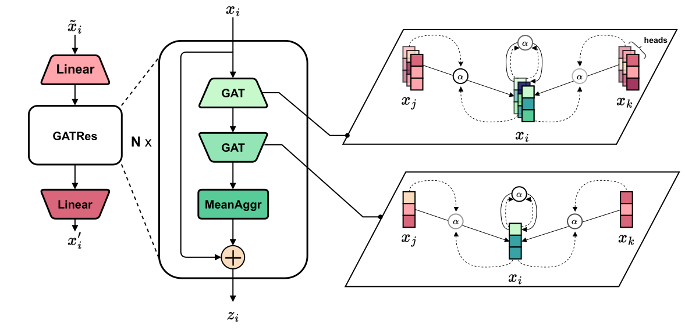

# GATRes

**G**raph **A**ttention Ne**T**work with **Res**idual connections

This is the official repository for the paper: **"Graph Neural Networks for Pressure Estimation in Water Distribution Systems"**.

## UPDATE: (21/04/2024)
Some changes in default parameters have propagated you to a minimal example on C-town.

First, you can create a dataset based on the default config using the below command:

``python scenegenv7.py  --executors 2 --batch_size 50 --config "configs/v7.1/ctown_7v1__EPYNET_config.ini``

The created dataset `ctown.zip` should be located in the `datasets` folder.

Next, we can train GATRes using the command:

``python train.py --model gatres_small --dataset_paths "datasets/ctown.zip" --input_paths "inputs/ctown.inp" --batch_size 32``


## Installation

You can follow the instructions to run the data generation tool and GATRes models. 

1. Clone or download this repository.
2. Activate *venv* environment with available Python (>=3.9), PyTorch (>=2.0), PyTorch Geometric (>=2.3), and/or CUDA (11.8). In case of a new environment, consider installing the required libraries via this command:

    ``pip install -r requirement.txt``

## Repo map

```
    |-- checkpoints                 - dir for storing model checkpoints #created in dataset generation process
    |-- configs                     - config storage for data generation tool  
    |-- experiment_logs             - dir for tracking experiment logs #created for loading model weights
    |-- generator                   - code for data generation tool
    |-- inputs                      - water distribution network topologies
    |-- utils                       - auxiliary functions for running models
    |-- ConfigModels.py             - default model configurations for running models
    |-- GraphModels.py              - model definition
    |-- evaluation.py               - code for testing model
    |-- train.py                    - code for training model
```

## Data generation tool

This section will give you an instruction to generate an example dataset. A dataset is a set of arbitrary snapshots, an instantaneous water network state at a particular time. A state can consist of one (some) measurement, such as pressures, heads, demands, etc... To create snapshots, run the following steps:

1. Add a preferred input file (.INP) that contains a topology into the `inputs` folder. 
Note: Skip this step if you use default public water networks in the folder (under public licenses).

2. Add a data generation config (.INI) file. User can create a dummy one using this command:
```
python generator\EPYNET\ConfigCreator.py -r inputs\<your_inp_path>
```
You can find the created config file (.INI) in the `configs` folder.

3. Run this command to create a dataset:
```
python generator\EPYNET\scenegenv7.py   --config <your_ini_path>
                                        --executors <num_of_workers>
                                        --batch_size <batch_size_per_worker>
```
There are many flags and options introduced in `scenegenv7.py`.

The new dataset will be a zip file (.ZIP).


## Training model

User can train GATRes model using this default command:
```
python train.py --model gatres_small
                --epochs 500
                --batch_size 8
                --device 'cuda'
                --mask_rate 0.95
                --datasets_paths <dataset_path1> <optional_dataset_path2> ...
                --input_paths <inp_path1> <optional_inp_path2> ...
                --test_data_path <test_dataset_path>
                --test_input_path <test_dataset_path>
                --save_path <where_to_save_checkpoints>
```

## Inference

When you run the above command, the trained model will be tested immediately after training. Otherwise, you can make a manual test using this command:

```
python evaluation.py    --model gatres_small
                        --model_path <where_to_load_trained_weights>
                        --batch_size 8
                        --num_test_trials 10
                        --test_type 'clean'
                        --device 'cuda'
                        --mask_rate 0.95
                        --datasets_paths <train_dataset_path> 
                        --input_paths <train_inp_path>
                        --test_data_path <test_dataset_path>
                        --test_input_path <test_dataset_path>
```

## License

MIT license. See the LICENSE file for more details.

## Citing

Please cite the following paper if you use the **GATRes** model or the **Data Generation Tool** in your research:

```
@article{truong2024gatres,
    author = {Truong, Huy and Tello, Andrés and Lazovik, Alexander and Degeler, Victoria},
    title = {Graph Neural Networks for Pressure Estimation in Water Distribution Systems},
    journal = {Water Resources Research},
    volume = {60},
    number = {7},
    pages = {e2023WR036741},
    keywords = {graph neural networks, water distribution networks, pressure estimation, state estimation, water distribution systems, water management},
    doi = {https://doi.org/10.1029/2023WR036741},
    url = {https://agupubs.onlinelibrary.wiley.com/doi/abs/10.1029/2023WR036741},
    eprint = {https://agupubs.onlinelibrary.wiley.com/doi/pdf/10.1029/2023WR036741},
    note = {e2023WR036741 2023WR036741},
    year = {2024}
}

```
